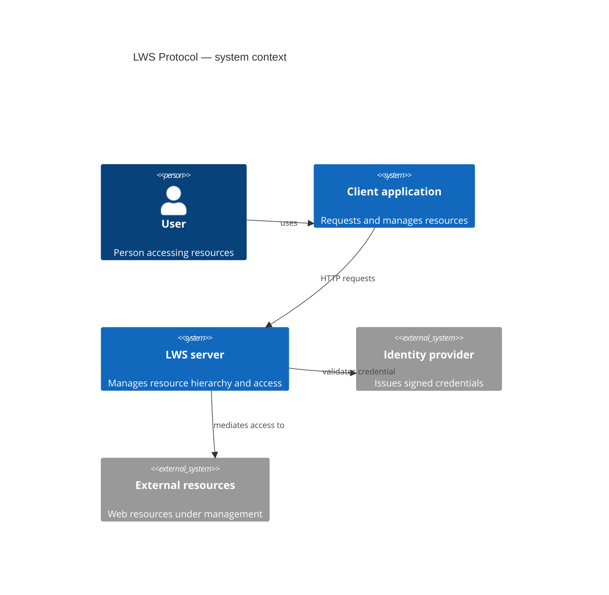

# LWS Protocol — System Context (C4 Level 1)

```mermaid
C4Context
  title LWS Protocol — system context

  Person(user, "User", "Person accessing resources")
  System(client, "Client application", "Requests and manages resources")
  System(lws, "LWS server", "Manages resource hierarchy and access")
  System_Ext(idp, "Identity provider", "Issues signed credentials")
  System_Ext(ext, "External resources", "Web resources under management")

  Rel(user, client, "uses")
  Rel(client, lws, "HTTP requests")
  Rel(lws, idp, "validates credential")
  Rel(lws, ext, "mediates access to")
```

