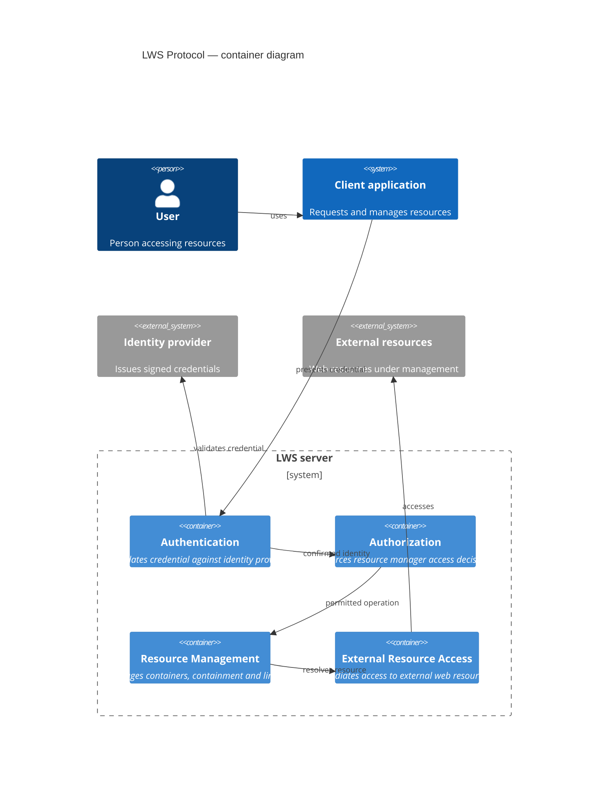

# LWS Protocol — Container Diagram (C4 Level 2)

Issue: The internal organisation of container, containment, and linkset management within the LWS server is not yet defined in the protocol. This diagram reflects current terminology and is subject to revision.
