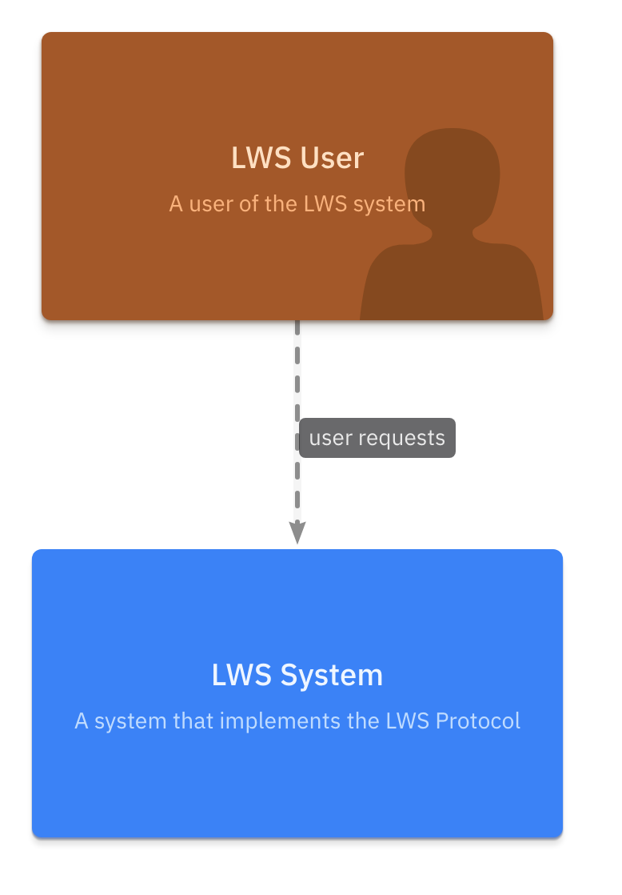
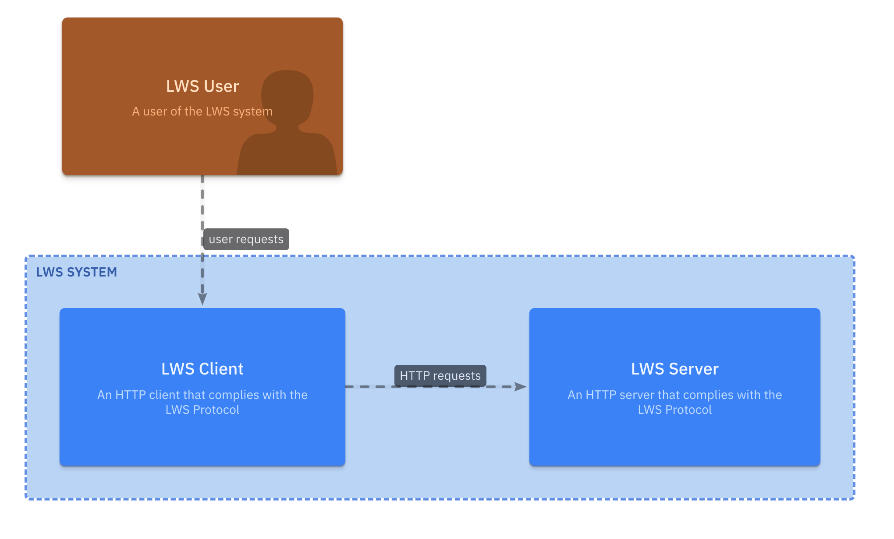
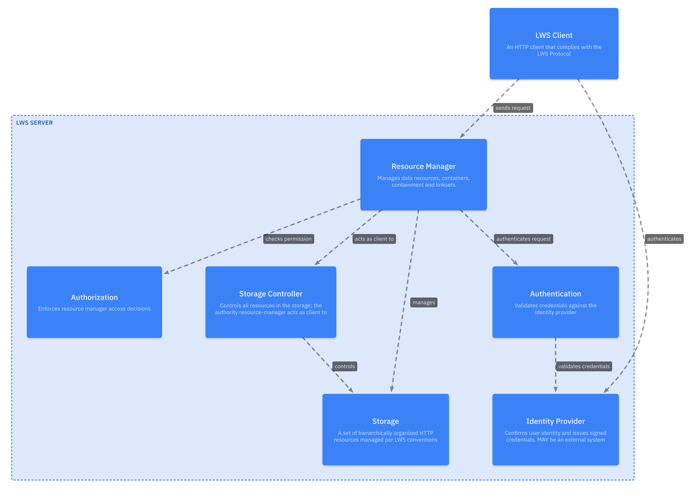
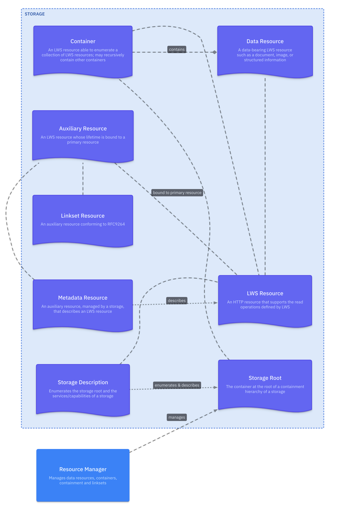

# Figures

A set of composition diagrams that model the [Linked Web Storage Protocol](https://w3c.github.io/lws-protocol/lws10-core/).

## Figure 1 - System Context Diagram

Shows the LWS System as a single unit and the person who uses it. Establishes scope only — no internal structure is shown.

| Box | Description |
|---|---|
| Agent | An agent of the LWS system |
| LWS System | A system that implements the LWS Protocol |

## Figure 2 - Container Diagram

Breaks the LWS System into its primary elements.

| Box | Description |
|---|---|
| Agent | An agent of the LWS system |
| LWS System | A system that implements the LWS Protocol |
| LWS Client | An HTTP client that complies with the LWS Protocol |
| LWS Server | An HTTP server that complies with the LWS Protocol |

## Figure 3 - LWS Server Component Diagram

Decomposition of the LWS Server into components and their responsibilities from client request to storage access.

| Box | Description |
|---|---|
| LWS Client | An HTTP client that complies with the LWS Protocol |
| LWS Server | An HTTP server that complies with the LWS Protocol |
| Resource Manager | Manages data resources, containers, containment and linksets |
| Authentication | Validates credentials against the identity provider |
| Authorization | Enforces resource manager access decisions |
| Storage Controller | Controls all resources in the storage directed by its client resource-manager |
| Identity Provider | Confirms user identity and issues signed credentials. MAY be an external system |
| Storage | A set of hierarchically organized HTTP resources managed per LWS conventions |

## Figure 4 - LWS Resource Type Hierarchy

The resource type taxonomy and relationship defined in the specification's Terminology section.

| Box | Description |
|---|---|
| Resource Manager | Manages data resources, containers, containment and linksets |
| Storage | A set of hierarchically organized HTTP resources managed per LWS conventions |
| LWS Resource | An HTTP resource that supports the read operations defined by LWS |
| Container | An LWS resource able to enumerate a collection of LWS resources; may recursively contain other containers |
| Data Resource | A data-bearing LWS resource such as a document, image, or structured information |
| Auxiliary Resource | An LWS resource whose lifetime is bound to a primary resource |
| Linkset Resource | An auxiliary resource conforming to RFC9264 |
| Metadata Resource | An auxiliary resource, managed by a storage, that describes an LWS resource |
| Storage Root | The container at the root of a containment hierarchy of a storage |
| Storage Description | Enumerates the storage root and the services/capabilities of a storage |

