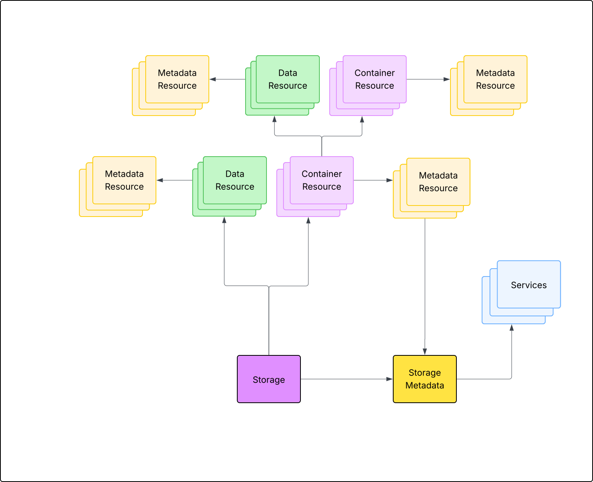
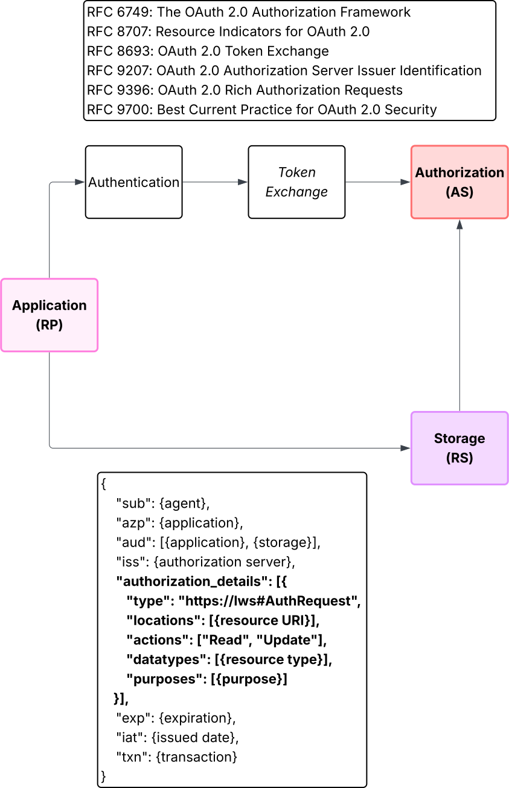

# October 2025 Face-to-face meeting

This directory contains resources that relate to topics discussed at the October 2025 meeting of the LWS Working Group.

These resources have been created as concrete suggestions based on the consensus positions of the group. As such,
the suggestions do not represent a consensus position of the working group, rather they are a starting point for
helping the working group advancing the conversations to achieve consensus.

## LWS Entities

The main conceptual entities discussed include the following:

* Storage
* Storage Metadata (example storage metadata as a CID/JSON-LD)[storage-metadata.json]
* Data Resource (example resource HTTP headers)[resource-headers.txt]
* Container Resource (example container as JSON-LD)[container.json]
* Resource Metadata (example linkset)[linkset.json]
  * Additional descriptive metadata may be formatted as RDF
* Service
  * Examples include a type index, notification service, and access request service

These entities are related to each other according to the following diagram:

## Authentication and Authorization

Given the OAuth2 model of resource servers (RS), authorization servers (AS), and relying parties (RP),
the focus of the LWS WG is to define an RS. Defining an AS or RP is out of scope, but it will be important
to clarify the expected interactions between each of these entities in order to achieve greater
interoperability across LWS implementations.

In the context of OAuth2, a diagram of this interaction is included here:

This flow relies on the following specifications:

* [RFC 6749: The OAuth 2.0 Authorization Framework](https://datatracker.ietf.org/doc/html/rfc6749)
* [RFC 9396: OAuth 2.0 Rich Authorization Requests](https://datatracker.ietf.org/doc/html/rfc9396)
* [RFC 8693: OAuth 2.0 Token Exchange](https://datatracker.ietf.org/doc/html/rfc8693)
* [RFC 9207: OAuth 2.0 Authorization Server Issuer Identification](https://datatracker.ietf.org/doc/html/rfc9207)
* [RFC 8707: Resource Indicators for OAuth 2.0](https://datatracker.ietf.org/doc/html/rfc8707)
* [RFC 9700: Best Current Practice for OAuth 2.0 Security](https://datatracker.ietf.org/doc/html/rfc9700)
* [RFC 7519: JSON Web Token](https://datatracker.ietf.org/doc/html/rfc7519)
* [OpenID Connect Core](https://openid.net/specs/openid-connect-core-1_0.html)

Notably, an [access token formatted as a JWT](access-token.json) would contain an `authorization_details` claim,
which the LWS specification would refine. An AS would need to be capable of evaluating access requests based on
these rich authorization requests. Likewise, an RS would need to be capable of enforcing RP access based on
this same data.

When no authorization credential is provided, an RS would reply with an HTTP 401 error, including a [challenge via
a WWW-Authenticate header](auth-challenge.txt). This response will inform an RP where to find the associated AS.

During the authentication portion of this flow, an [agent profile](agent.json) is represented as a
[Controlled Identifier Document (CID)](https://www.w3.org/TR/cid-1.0/). The RP, in this case could use either
an OpenID Connect (browser-based) authentication flow (e.g. `sub != iss != azp`) or, if the RP is capable of managing
its own secrets, it can produce its own tokens with a private key (e.g. `sub == iss == azp`). The associated CID makes
it possible for the AS to validate the identity of the agent.

For delegated authentication, the `azp` claim (authorized party or RP) will be a URI validated by the issuer using a mechanism such as
[OAuth Client ID Metadata](https://www.ietf.org/archive/id/draft-ietf-oauth-client-id-metadata-document-00.html)
or [OpenID Federation](https://openid.net/specs/openid-federation-1_0.html). A sample
[Client ID Metadata document](client-id-metadata.json) is provided here.

When using OpenID Connect for authentication, a `.well-known/openid-configuration` resource is
[provided as an example](openid-configuration.json).

When using OAuth 2.0 for authorization, a `.well-known/oauth-authorization-server` resource is
[provided as an example](oauth-configuration.json).

## Associated Vocabularies

The examples provided here make assumptions about the existence of a [LWS vocabulary](lws.ttl) and/or
a [LWS JSON-LD Context](context-v1.jsonld). The structure and content of these two artifacts is speculative
at present. Any changes in the examples above will lead to significant changes in any vocabulary document.

